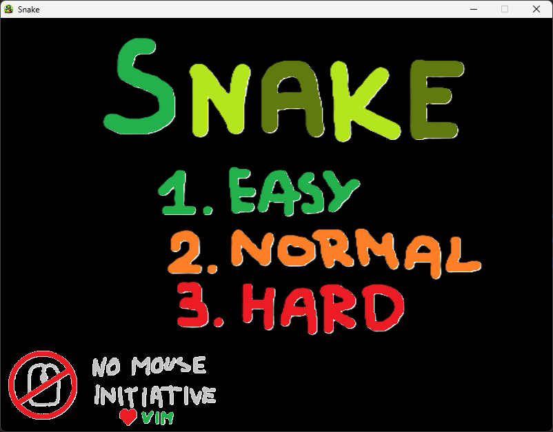
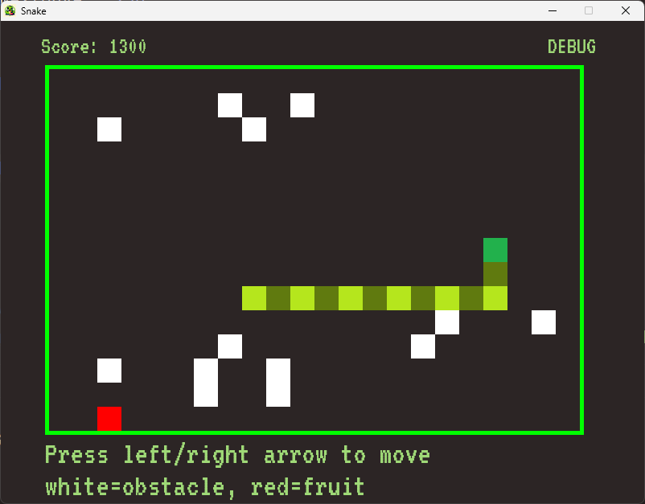
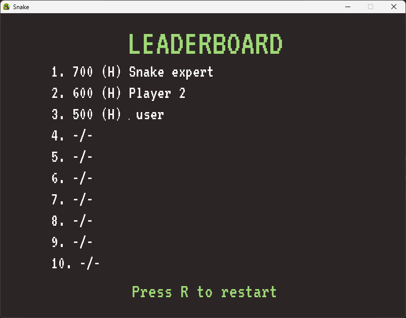

# Snake - the game

### Prerequisites

- CMAKE >= 3.26
- C++ 17
- [SMFL 2](https://www.sfml-dev.org/)

### Gameplay

In main menu press 1, 2 or 3 to choose game mode (or secret key combination 
for debug mode) or press Q to exit. Use left or right arrow to move change 
snake's heading. Note that up/down arrows doesn't change the heading (game 
would be too easy). In leaderboard view press R to restart.

Eat **red fruits** to increase score and snake's length.

Avoid **white obstacles**, walls or your tail! Hitting one of those will end 
the game.

After loosing you will be prompted to enter your nickname. If you manage to 
get good enough score, you might see your result in Top 10 Leaderboard!
Leaderboard is stored in `leaderboard.txt` file.

### Gallery

